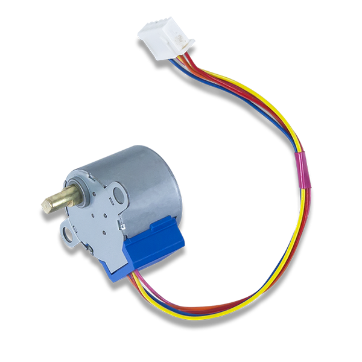

# ABOUT THIS PROJECT

Hello everyone, my name is Phuc Hoang Nguyen, student of Computer Engineering Technology from Humber College. 
If you want to build a project to control 28BYJ-48 Stepper Motor with ULN2003APG driver, this is a step by step blog to help you achieve that.

 

# COMPONENTS AND SUPPLIES

28BYJ-48 Stepper Motor 

 

ULN2003APG Driver 

 

It is better to buy the whole arduino kit on amazon, as the kit will have all the component needed for the project, this include: 

+) uln2003APG 
+) 28BYJ-48 stepper Motor 
+) Arduino  
+) Beard board 
+) Wire 
+) Jumper Wire 

Link to buy the [arduino kit](https://www.amazon.ca/Elegoo-Project-Starter-Tutorial-Arduino/dp/B01D8KOZF4/ref=sr_1_1_sspa?crid=2DVN7H6ZQLWPG&keywords=arduino+kit&qid=1574921884&sprefix=arduino+k%2Caps%2C145&sr=8-1-spons&psc=1&spLa=ZW5jcnlwdGVkUXVhbGlmaWVyPUExTUVOUEhHNEhDTUZQJmVuY3J5cHRlZElkPUEwOTc2NjcxQVRIUzQyVFBNQUg3JmVuY3J5cHRlZEFkSWQ9QTA3NjA2NDQxMFhPMlJCUkVSSlRJJndpZGdldE5hbWU9c3BfYXRmJmFjdGlvbj1jbGlja1JlZGlyZWN0JmRvTm90TG9nQ2xpY2s9dHJ1ZQ==)

So instead of waiting months for your components to arrive if you purchase through China company, the shipping time will aproximately 2 bussiness days through amazon. 

# SOFTWARE

https://www.arduino.cc/en/Main/Software  
https://fritzing.org/home/

# NECESSARY TOOLS AND MACHINES

Soldering iron gun 

# Wiring - Connecting the Driver with the Arduino and the motor 

The wiring diagram/schematic below shows you how to connect the ULN2003 driver board to the 28BYJ-48 stepper motor and the Arduino.

I use jumper wire with different color to make the connect as the picture above.

# ULN2003 and 28BYJ-48 to Arduino Connections

| ULN2003APG    | Connection     |
| ------------- | -------------  |
| IN1           | Pin 11 Arduino |
| IN2           | Pin  9 Arduino |
| IN3           | Pin 10 Arduino |
| IN4           | Pin  8 Arduino |
| -             | Ground Arduino |
| +             | 5V Arudino     |

# PCB Design
 
 I use fritzing software to design my PCB, here is my final design. You should definately get the PCB made as soon as possible because it takes around 3~4 days to finish. 
 
 
 
 Gerber export file [here](https://github.com/HoangPhuc1999/SmartHome/tree/master/Documentation/GERBER)
 # Solder Precaution: 
-For those who are beginners in solder, it is recommended to have more than one PCB made for this project. Set the solder Pen no hotter than 350F
-Never touch the element or tip of the soldering iron. They are very hot (about 400°C) and will burn.
-Hold wires to be heated with tweezers or clamps.
-Keep the cleaning sponge wet during use.
-Always return the soldering iron to its stand when not in use. Never put it down on your workbench.
Turn unit off or unplug it when not in use.
 
 # Solder the PCB
 
 

 # Basic Arduino example code to control a 28BYJ-48 stepper motor
 
 
 
 

 

