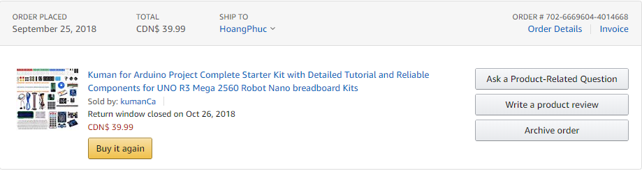

# SmartHome

# Week 14: December 10th - Build Instruction Due
Status update: ReadMe.md is complete

# Week 13: December 5th - Presentation Day
# Week 12: November 28th - Presentation Due
Status update:
- finish assemble and glue the case.  
- Solder the newest version of PCB.  

 

# Week 11: November 21st - finish the case

Financial update:
- I am manage to cut down the budget of the project to $40 buy excluding the blutooth chip out of the project
- PCB is made free
- The case is also made free

 

# Week 10 - 14th Nov, 2019 - PCB Powered Up 
Status update:
- I decided to upgrade my pcb because the old pbc doesn't have connection for ground and 5V power line
- This is the new version of my PCB

# Week 9:  7th Nov, 2019 - PCB Soldered

# Week 8: October 31st - Build the beard board
 

# Week 7: October 24th - Design the PCB

 
 
 

# Week5:October 3rd - Proof of purchase[Purchase](https://github.com/HoangPhuc1999/SmartHome/blob/master/Documentation/ProofofPurchase.docx)
 

# Week4:September 26th - Budget due [Budget](https://github.com/HoangPhuc1999/SmartHome/blob/master/Documentation/BudgetDueWeek4.xlsx)
# Week3:September 19th- Schedule due [schedule](https://github.com/HoangPhuc1999/SmartHome/blob/master/Documentation/smartDenGantt%20(1).mpp)
# Week2:September 12th- Proposal due [Proposal due](https://github.com/HoangPhuc1999/SmartHome/blob/master/Documentation/ProposalContentStudentNameRev03.xlsx)
